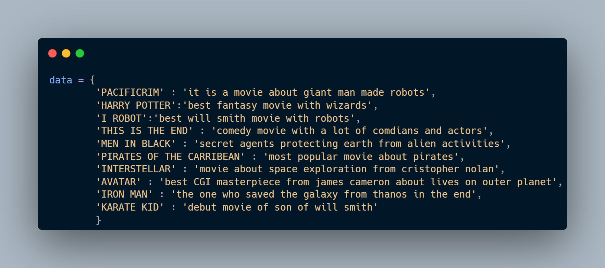
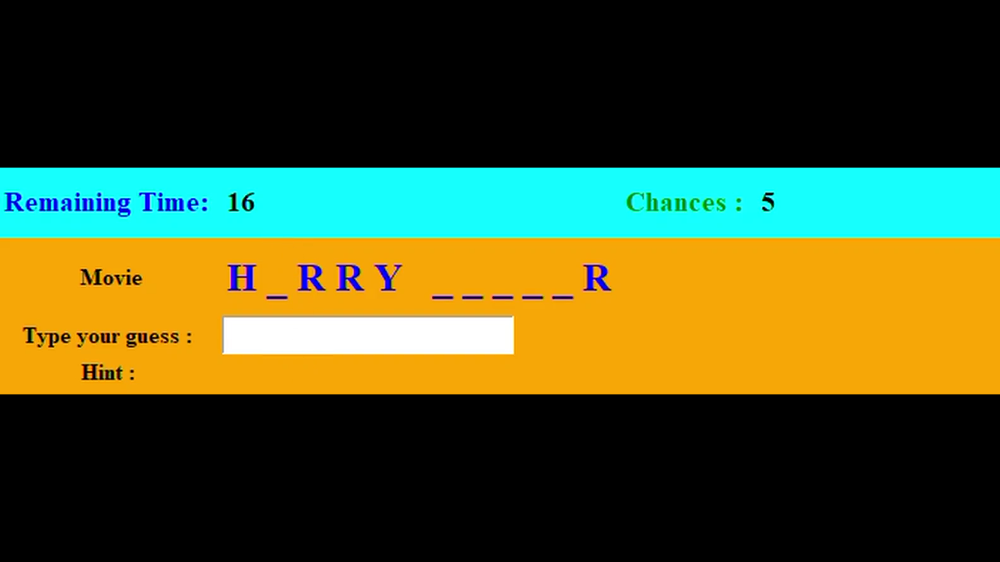

# GuessThatMovie

It is a simple Tkinter based guessing game.


## Rules

- See the prompted movie name with blanks, guess the movie and type the name in the input box.
- 3 Chances, 20 seconds for each chance.
- Chances decrease if answer is Incorrect or Time runs out.
- By clicking on the Hint you can see the hint for that movie.


## Features


- Timer
- Hints
- Chances (5)
- Shows original guess with random spaces
- InputBox to type the guess
- Sounds for correct/incorrect guesses


## Dependencies

- tkinter 
- playsound
## Deployment

To deploy this project run download this folder consisting game file and sounds then run

```bash
  GuessThatMovie.py   // First install all neccessary dependencies listed above.
```


## Customizing Movie Data

- The current movie data can be edited by simply changing the data dictionary inside the code.
- Data =  { Movie_Name: Associated_Hint }
- 

## Demo

Download demo video from here:

https://github.com/DhruvDholakiaCE/GUIprojects/blob/master/GuessThatMovie/GuessThatMovieDemo.mp4


## Screenshots




## Lessons Learned

Setting up GUI elements like sound effects and timer with Threading to provide concurrent execution.
## Authors

- [@DhruvDholakia](https://www.github.com/DhruvDholakiaCE)

